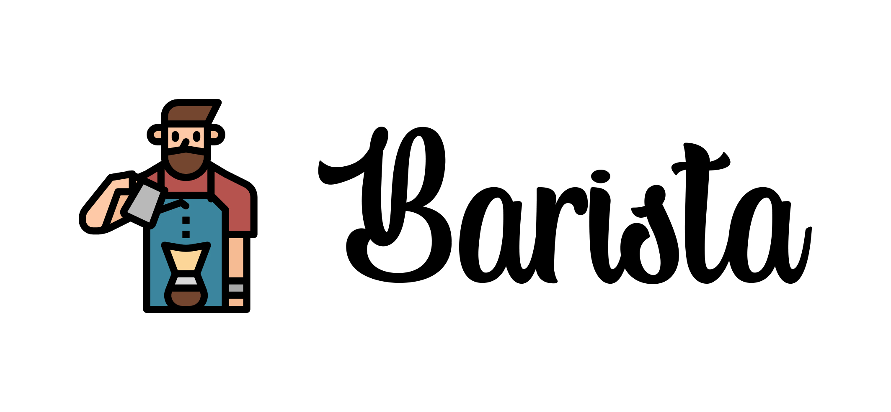

<div align="center">


[](https://hits.seeyoufarm.com)

</div>

Barista is a vite plugin that scans your project's HTML / JSX and creates non-semantic CSS Rules based on classNames that conform to a format which you define.

### Example

Include this in your HTML / JSX:

```html
<p className="_display--inline-block"></p>
```

And barista will generate the following CSS rule

```css
._display--inline-block {
  display: inline-block;
}
```

### How's it work?

You create a className by combining:
an initial character of your choice (i.e. `"_"` in the above example) + a valid CSS property name + a custom delimiter of your choice (i.e. `"--"` in the above example) + a valid CSS value for the designated property.

That's all! Barista scans your project and formats your classNames into CSS Rules.

### Some more examples

```html
<p className="_margin--1rem-0-10px-auto"></p>
```

```css
._margin--1rem-0-10px-auto {
  margin: 1rem 0 10px auto;
}
```

```html
<p className="_border--1px-solid-var-gray-100"></p>
```

```css
._border--1px-solid-var-gray-100 {
  border: 1px solid var(gray-100);
}
```

# Setup

### 1. Install

Install using npm

```sh
npm install @modularmoon/barista --save-dev
```

### 2. Configure

Include the following import statement in your `vite.config` file:

```js
import baristaCSS from "@modularmoon/barista";
```

> **Note:** 💡 Make sure not to include any `{` `}` characters in the import statement, as this is the default module exported by the package.

Update the plugins object of your `vite.config` file to include the following plugin function.

```js
baristaCSS({
      include: ["src/**/*.{js,ts,jsx,tsx,html}"],
      outputFilepath: "src/css/barista.css",
      delimiter1: "_",
      delimiter2: "--",
    }),
```

For clarity, your entire config object should look something like this:

<pre><code>export default defineConfig({
  plugins: [
    react(),
    <span style="color: red;">baristaCSS({
      include: ["src/**/*.{js,ts,jsx,tsx,html}"],
      outputFilepath: "src/css/barista.css",
      delimiter1: "_",
      delimiter2: "--",
    })</span>,
    ...],
    server: {...}});</code></pre>

#### Configuration Options

`include`: This is an array of filepaths + filename extensions that you want Barista to scan for classNames.

`outputFilePath`: This is the filepath + filename where you'd like Barista to generate it's CSS file.

`delimiter1`: This is the symbol you'd like to include as the first character of your non-semantic classNames, in order to indicate to Barista that you'd like it to parse / format these classnames into CSS Rules.

`delimiter2`: This is the symbol you'd like to include inbetween the property and the value of the classname, in order to delineate the two.

### 3. Include

Now you can link to this local CSS file normally as a stylesheet, via your preferred method.

i.e. via HTML:

```html
<link rel="stylesheet" href="src/css/barista.css" />
```

or via Javascript:

```js
import "./css/barista.css";
```

## Usage

In your HTML or JSX, whenever you want to include a non-semantic classname to simply apply a basic CSS property / value to an element, simply include the classname delineated with the delimiter options you specified in your plugin object.

### License

Barista is distributed under an [MIT License](https://github.com/maxnelson/barista/blob/main/LICENSE.md)
